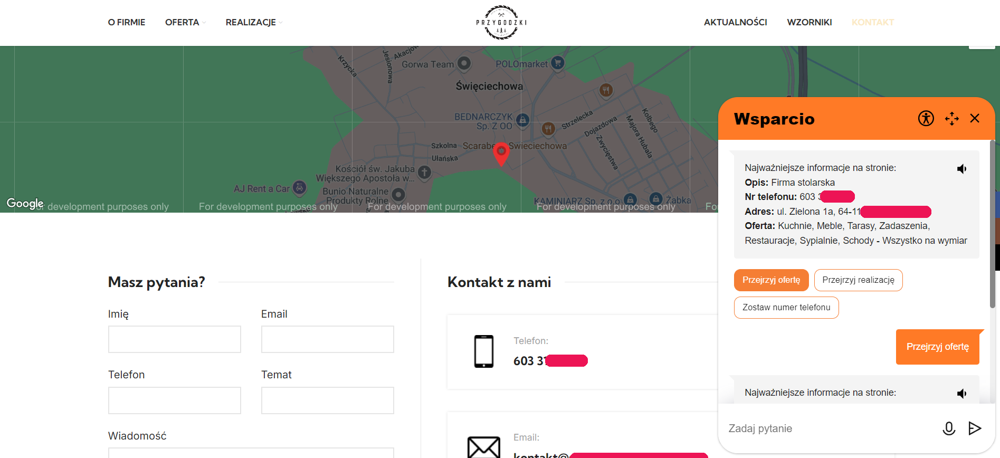

# Chat Application

This project is a chat application that focuses on improving the accessibility of the old messy websites. This chrome extension was built using Angular. It includes components for displaying chat messages and action chips, allowing users to interact with the chat interface.
  
## Features

- **AI Integration**: Integrate AI chatbot to provide automated responses.
- **Action Chips**: Interactive buttons that trigger actions within the chat.
- **Audio Input**: Record audio messages and send them to the chat.
- **Accessibility**: Accessible UI written along WCAG standards.
- **Listen to Messages**: Listen to messages using the text-to-speech feature.

## Technologies Used

- **TypeScript**
- **JavaScript**
- **Angular**
- **npm**

## How to use the extension

1. Download the extension from the releases section in this repo.
2. Open Chrome and navigate to `chrome://extensions/`.
3. Enable "Developer mode" in the top right corner.
4. Click "Load unpacked" and select the `zip` folder from the project directory.
5. The extension should now be loaded and ready to use.

## Preview

